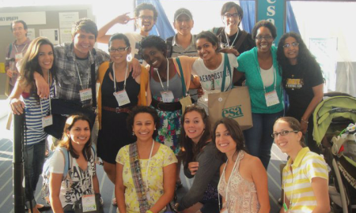

I am a current Master of Public Policy (MPP) Candidate with a strong interest in Data Sciences in Public Service. I have always been intrueged by data, and the stories it is capapble of telling us about the communities we study. With experience working across a diverse variety of sectors, I possess a broad and well versed understanding of how programs affect the communities for which they are implimented.

My goal is to make a substantial contribution to by community by helping to tell the stories of our community data, and helping decision makers may well-infromed decisions for their communities.

### My Journey to Data Sciences

Helping to build community through public service and community solutions has been a passion of mine for some time now. Whether through helping to build collaborative efforts between organizations and their community, or simply reaching out to those around me to make sure that they have everything they need to lead happy and healthy lives, I have often found myself in a role of service to others.

While completing my undergraduate at Arizona State, I also got involved with extracurriculars, co-founding and leading the student organization – SEEDS Devils: The ASU Chapter of Strategies for Ecological Education, Diversity and Sustainability. We collaborated with regional organizations, communities, and agencies, and worked to create opportunities like the interactive field experiences which explored the cultural and social-ecological aspects of water rights in native communities. While in SEEDS, I also partnered with students from other universities in the southwest region, to create opportunities for the members of Dine College chapter; a 2-year college on the Navajo Reservation; to visit various 4-year colleges in the region. As a first-generation college student, I had first-hand experiences of the challenge in finding your way around a university setting by oneself, and wanted to develop a way to help foster relationship before these students even made the decision to attend their new school of choice.

After graduating from ASU and completing my undergraduate research, I joined an AmeriCorps program focused on conservation efforts in Arizona. This experience gave me an opportunity to work in a collaborative project between the Coconino National Forest Service and the Oak Creek Watershed Council, a local non-profit working closely with the forest service to develop sustainability efforts in Oak Creek. During my time in Oak Creek, I organized a symposium around the various issues in the watershed. The event had the participation of 14 government agencies, organizations and academic institutions. Sustainability minded students from ASU, UofA, and NAU were also invited to help create awareness for the opportunities each organization had to offer. The symposium was seen as a great way to get key stakeholders and decision-makers in the same room, and is now held annually as a think tank for those institutions.

Upon completing my term with AmeriCorps, I returned to Phoenix with an increased interest in working for a community outreach program, but thought it strategic to focus on sharpening my marketing and project management skills. I’ve found that the leadership of almost every successful non-profit I’ve worked with has had a background in marketing. In pursuing this skillset, I have been given the opportunity to learn how to organize and promote successful campaigns and events aimed at creating awareness and opportunities for my teams in their respective areas of service. In addition to my responsibilities in marketing at Sun Valley Solar Solutions, I currently sit as the chair to the company’s Community Committee. Since stepping into this role, I have helped to develop a standing scholarship and grant program for students at the ASU School of Sustainability, created a corporate matching program for employee community outreach efforts and have overseen multiple volunteer opportunities and drives for local organizations across the state.

In June 2018, I returned to ASU, as the Marketing & Communications Specialist for the Opportunities for Youth initiative in the Watts College of Public Service and Community Solutions. In this role, I work with a wide array of partners and community representatives to market resources and opportunities for success to disconnected youth. It is this type of work, working to make a meaningful difference in the world, that is what I find truly rewarding. I am excited to be traveling the path I am on and working to be a catalyst for positive change in the community, while helping to build foundations for empowerment and success.
